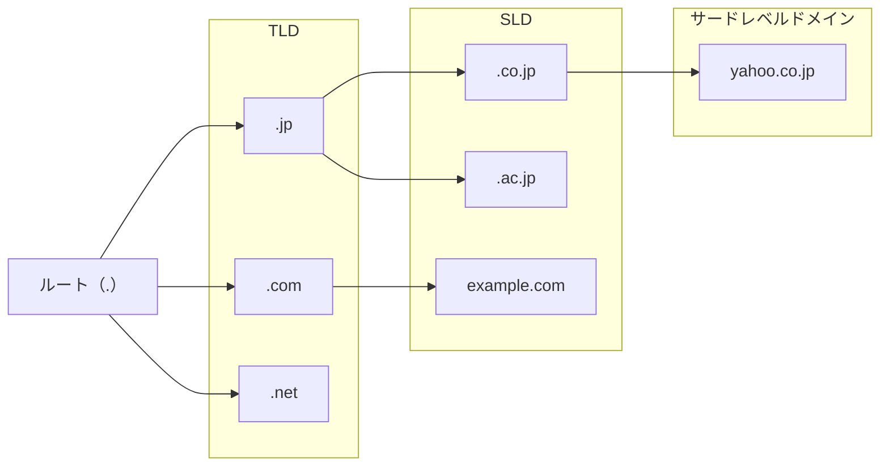
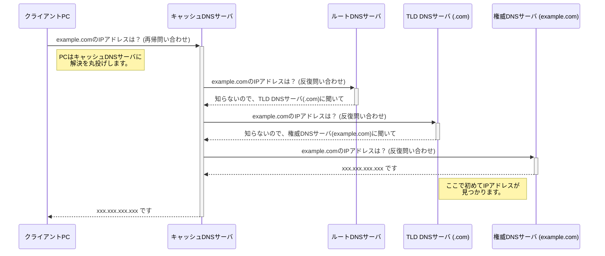

本記事では、DNSの基本的な仕組みについて、`hosts`ファイルの役割から、実際の名前解決プロセスまでを追っていきます。

## 事前知識

### 1. ドメイン名

ドメイン名とは、インターネット上のネットワークや組織を識別するための階層的な名前です。

例えば、「Yahoo!Japan」は`yahoo.co.jp`というドメイン名を持っています。  
このドメイン名は具体的なデバイスを指す訳ではなく、Yahooのネットワークを識別するための名前です。

Yahooが持つWebサーバにアクセスしたければ、`www.yahoo.co.jp`となります。  
この`www`を **ホスト名** と呼び、ホスト名はネットワーク内でデバイスを識別するために使います。

`www`は、World Wide Webの略で、Webサーバのホスト名としてよく使われます。  
他にも、`mail`や`dns`など、そのサーバにあったホスト名で、デバイスを識別します。

ドメイン名にホスト名を追加した`ホスト名.ドメイン名`の形を **FQDN（完全修飾ドメイン名)** といいます。

### 2. digコマンド

`dig`（Domain Information Groper）コマンドは、**DNSサーバに対して問い合わせを行い、その応答の詳細を表示するためのコマンドラインツール** です。  
DNSサーバが、名前解決のために情報を収集する過程を追跡・確認するのに役立ちます。

記事の後半で実際に使っているので、そこを見ていただくとイメージしやすいと思います。

## `hosts`ファイルとDNSの歴史

TCP/IP通信では、コンピュータは **IPアドレス** を使って通信相手を特定します。

しかし、数字の羅列であるIPアドレスは人間にとって非常に覚えにくいものです。  
そこで、「IPアドレス」と「ホスト名」を対応付けるための`hosts`というファイルが各コンピュータ内に置かれるようになりました。

ホスト名でアクセスすると、OSがこのファイルを読んで、対応するIPアドレスに変換してくれる、というシンプルな仕組みです。

当初はこれで十分でしたが、インターネットが普及し、世界中のコンピュータと接続する必要が出てくると、この仕組みでは限界が見えてきます。

- インターネット上のすべての「ホスト名とIPアドレスの対応表」を、世界中の全PCに配布するのは不可能。
- IPアドレスが変更されるたびに、全PCの`hosts`ファイルを更新するのは非現実的。

この問題を解決するために生まれたのが **DNS（Domain Name System）** です。

DNSは、特定の管理者が一元的に情報を管理するのではなく、ドメイン情報を **「階層的」かつ「分散的」** に管理することで、インターネット規模での名前解決を可能にしました。  
この機能を提供するサーバをDNSサーバと呼びます。

### `hosts`ファイルの現在と実践的な使い方

DNSが主流となった現在でも、`hosts`ファイルは利用されています。  
**DNSへの問い合わせより先に`hosts`ファイルが参照される** ため、特定ドメインのIPアドレスを意図的に書き換える、といった使い方ができます。

**hostsファイルのパス:**
- **macOS / Linux:** `/etc/hosts`
- **Windows:** `C:\Windows\System32\drivers\etc\hosts`

**実践例：開発環境での利用**

例えば、`myapp.com`というドメインで開発中のWebアプリケーションを動かしたいとします。  
DNSサーバがなければ、ブラウザは`myapp.com`のIPアドレスを知ることができずアクセスできません。

そこで、`hosts`ファイルに以下の一行を追加します。

```
127.0.0.1  myapp.com
```

これにより、`myapp.com`へのアクセスは、 **DNSに問い合わせることなく** 、強制的に自分自身のコンピュータ（`127.0.0.1`）に向けられます。

結果として、`http://myapp.com`というURLで開発中のアプリにアクセスできるようになり、より本番に近い環境でテストができます。

## DNSによる名前解決の仕組み

DNSは、ドメイン情報を階層構造で管理しています。



頂点には **ルートドメイン** があり、その下に`.jp`や`.com`といった **TLD（トップレベルドメイン）** があります。  
さらにその下に続くドメインを **SLD（セカンドレベルドメイン）** 、 サードレベルドメインと呼び、個別のドメインが続きます。

各階層のドメインは、それぞれ **異なるDNSサーバ** によって管理されています。

### 名前解決のプロセス：再帰問い合わせと反復問い合わせ

では、私たちがブラウザに`example.com`と入力したとき、PCはどのようにしてIPアドレスを知るのでしょうか。  
ここには2種類の問い合わせが関わっています。

1. **再帰問い合わせ (Recursive Query)**
    - PCから、まず最寄りのDNSサーバ（プロバイダなどが提供する **キャッシュDNSサーバ** ）に対して「`example.com`のIPアドレスを教えて」と依頼します。
    - 依頼されたキャッシュDNSサーバは、依頼者に代わって、答えがわかるまで他の **権威DNSサーバ** への問い合わせを繰り返します（反復的クエリ）。

2. **反復問い合わせ (Iterative Query)**
    - キャッシュサーバは、まずルートDNSサーバに「`example.com`を知ってる？」と聞きます。
    - ルートサーバは「知らないから、`.com`を管理しているDNSサーバに聞いてね。」と返します。
    - キャッシュサーバは、次にその`.com`のDNSサーバに「`example.com`を知ってる？」と聞きます。
    - `.com`サーバは「知らないから、`example.com`を管理しているDNSサーバに聞いてね。」と返します。
    - 最終的に、キャッシュDNSサーバは`example.com`の権威DNSサーバにたどり着き、IPアドレスを取得します。

このように、クライアントからの依頼は「**再帰的**」に、サーバ間の問い合わせは「**反復的**」に行われるのが基本です。



### `dig`コマンドで名前解決を追跡する

この反復問い合わせの様子は、`dig +trace`コマンドで実際に確認することができます。

```bash
$ dig +trace example.com

; <<>> DiG 9.10.6 <<>> +trace example.com
;; global options: +cmd
.                       512756  IN      NS      b.root-servers.net.
.                       512756  IN      NS      g.root-servers.net.
# ... (ルートサーバの一覧) ...
.                       512756  IN      NS      a.root-servers.net.
;; Received 1097 bytes from 2400:2653:9812:9900:1e7c:98ff:fe12:1e4c#53 in 19 ms

com.                    172800  IN      NS      l.gtld-servers.net.
com.                    172800  IN      NS      j.gtld-servers.net.
# ... (.comのgTLDサーバ一覧) ...
com.                    172800  IN      NS      e.gtld-servers.net.
;; Received 1171 bytes from 198.41.0.4#53(a.root-servers.net) in 22 ms

example.com.            172800  IN      NS      a.iana-servers.net.
example.com.            172800  IN      NS      b.iana-servers.net.
;; Received 235 bytes from 192.55.83.30#53(m.gtld-servers.net) in 25 ms

example.com.            300     IN      A       23.192.228.80
example.com.            300     IN      A       23.192.228.84
# ... (example.comのAレコード) ...
;; Received 398 bytes from 2001:500:8d::53#53(b.iana-servers.net) in 145 ms
```

この出力結果から、以下の流れが読み取れます。

1.  `dig +trace`は、まず**ルートDNSサーバ** (`a.root-servers.net`など)に問い合わせ、`.com`ドメインを管理する**gTLDサーバ**のリストを受け取ります。
2.  次に、そのリストから選んだサーバ（`m.gtld-servers.net`）に問い合わせ、`example.com`を管理する**権威DNSサーバ** (`a.iana-servers.net`など)のリストを受け取ります。
3.  最後に、`b.iana-servers.net`に問い合わせ、`example.com`の**Aレコード**（IPアドレス）を取得しています。

このように、コマンドを使って実際の動きを見ることで、DNSの階層構造と分散管理の仕組みがより深く理解できるはずです。

## まとめ

今回は、名前解決の基本的な仕組みについてまとめてみました。

digコマンドを使うと、手軽に名前解決の動きを見ることができるので、積極的に使っていこうと思います。

また、続編として、「DNSサーバの設定方法」や「DNSにまつわる脆弱性」についてまとめようと思っています。

