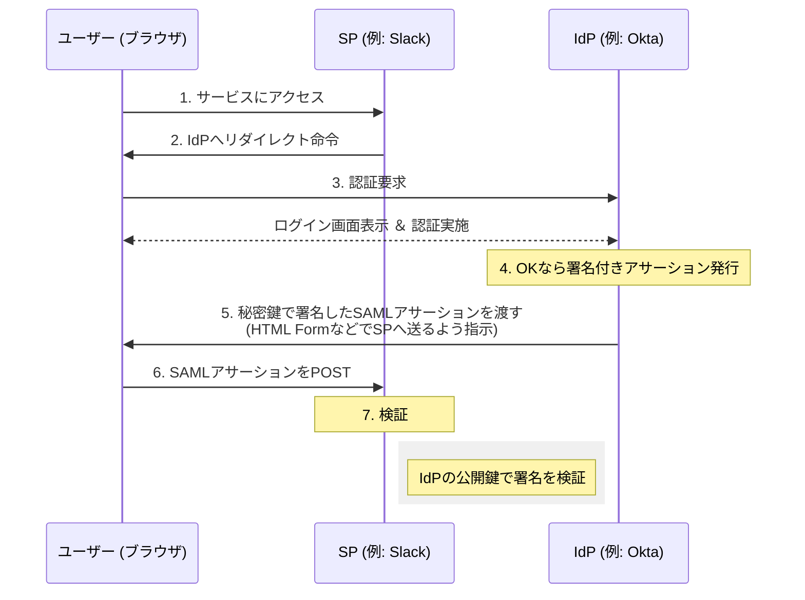
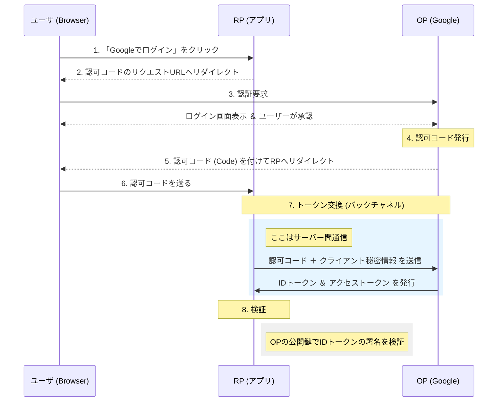

本記事では、SSOについてまとめています。

## SSOとは

SSOとは、Single Sign Onの略で、**一度の認証で複数のサーバやアプリを利用できる仕組み**です。

通常は利用するサービスごとに認証を行う必要がありますが、一度の認証でクライアントが利用可能なサービスをすべて利用できるようになります。

認証の手間を省ける上に、複数のパスワードを管理する必要がなくなるので、パスワードの管理も楽になります。

## SSOの手法

SSOには大きく次の4つの手法に分けられます。

- **ID連携方式**
- チケット方式
- エージェント方式
- リバースプロキシ方式

ここでは、現在主流であるID連携方式を深掘りしていきますが、その前に他の3つの手法について簡単にまとめておきます。

### チケット方式

ユーザは、認証サーバで認証を受け、完了するとチケットを受け取ることができます。

各サービスはそのチケットを確認することで、認証済みのユーザであることを判断します。

チケットとして、HTTPにおける**Cookie**が使われることが多いです。

代表的なチケット方式として**ケルベロス認証**があります。  
ここでは詳しく書きませんが、社内LANなど閉じられたネットワークでは今でも使われます。

### エージェント方式

SSOを構築するサーバそれぞれに、エージェントと呼ばれる認証用のソフトウェアをインストールする方式です。

チケット方式を前提として、そのチケットの確認方法をエージェントによって行います。  
そのため、よくチケット方式と同じ文脈で語られますが、厳密には以下の違いがあると私は解釈しました。

- チケット方式はエージェントを必須とせずアプリ側で確認することもできる、エージェント方式を含んだ広い方式
- エージェント方式は、チケット方式を前提としたクライアント側の実装方式

エージェント方式はアプリが認証せずエージェントが担当するため、**アプリを改造しなくて済みます**。  
しかし、OSをアップデートしたらエージェントが動かなくなったり、Webサーバのバージョンとの相性問題などもあり、今では使われなくなってきており、ID連携に置き換わってきています。

### リバースプロキシ方式

インターネット側にいるユーザはリバースプロキシサーバに接続しユーザ認証を行う方式です。

プロキシサーバで認証が完了しているため、ユーザから見てその奥にあるサーバとの通信は認証済みのユーザとして通信ができます。

この方式はアプリの外側でSSOを実装できるため、アプリ側に手を加えられない古いシステムをSSO化するときに使われます。

## ID連携（IDフェデレーション）方式

信頼できる**IdP（Identity Provider）**の秘密鍵を使ってデジタル署名を施し、各サービスに署名付きデータを見せることでユーザ認証を行う方式です。  
認証情報のみではなく、ユーザの属性を渡すこともできます。

ID連携方式では、IdPとSP（OIDCではRP）の2つが役割を分担します。  
チケット方式と似ていますが、チケット方式の多くはログイン情報をCookieに保存します。  
しかし、例えば`A.com`で発行されたCookieは、別ドメインの'B.com'へのリクエストに添付できないというブラウザのルールがあります。

つまり、チケット方式ではチケットを受け取っても、ブラウザはそれをLAN外部のサービスに送ることができません。  
そのため、SlackやSalesforceなどの外部サービスのSSOではチケット方式は使えません。

ID連携は、ブラウザのCookieに頼らず、次のようなブラウザのリダイレクト（HTTP302）とデジタル署名を使うことで、この問題を回避しています。

1. IdPが秘密鍵を使って、偽造不可能な署名付きのデータを作る（この署名付きデータにはユーザ情報が含まれており、**アサーション**や**トークン**と呼ぶ）
2. IdPはブラウザに対して「この署名付きデータをサービスに渡して」と命令を送る
3. ブラウザは言われた通り、サービスにアクセスし署名付きデータを渡す
4. データを受け取ったサービスは、受け取ったデータに「IdPの署名」があることを確認する

このように、ドメインの壁を超えて情報を運べる相互運用性と、盗難されても解読・改ざんできないセキュリティの2つが揃い、LANを超えたSSOが実現しました。

ID連携方式は、大きく次の2つに分けられます。
- **SAML（Security Assertion Markup Language）**
- **OIDC（OpenID Connect）**

### SAML

SSOを実現するためのプロトコルです。

**アサーション（assertion）**というXMLドキュメントを使い、次の情報をやりとりします。
- 認証情報（認証したサーバ、認証時間）
- 属性情報（利用者の名前や属性）
- 認可情報（利用者がアクセスできる範囲）

SAMLは、次の3つの構成要素からなります。
- IdP（Identity Provider）
- SP（Service Provider）
- クライアント

現在のバージョンは、SAML2.0となっており、  
通信プロトコルは、HTTPやSOAPが使われます。

企業内システムや、歴史のあるB2Bツールでは今も主流です。  
ブラウザを介したPOSTによる受け渡しが基本で、**バックエンド同士の通信が不要なケースが多い**です。  
重厚で堅牢ですが、OIDCに比べると複雑な面があります。

下の図は、HTTPリダイレクトを利用する方法です。
IdPとSPはあらかじめ信頼関係を結んでいることが前提になります。

1. クライアントはWebブラウザから利用したいSPにアクセスする
2. SPでは認証を行わず、IdPにリダイレクトするようにクライアントに応答する
3. リダイレクトを受け、クライアントはIdPにアクセスして認証を行う
4. 認証がOKであれば、IdPは秘密鍵で署名したアサーションを発行する
5. アサーションとリダイレクト命令をクライアントに送る
6. クライアントはSPにアサーションを提示する
7. SPは公開鍵で署名を検証し、認証情報や認可情報を確認する

### OIDC

SSOを実現するために、**OAuth 2.0を拡張して認証機能を追加した**プロトコルです。

構成要素は次の2つです。
- OP（OpenID Provider）：SAMLでいうIdPのこと（Google、Oktaなど）
- RP（Relying Party）：サービス（SAMLでいうSP）のこと。OAuth 2.0ではクライアントと呼ばれる
- エンドユーザ
厳密にはこのように定義されていますが、OPをIdPと呼ぶことも多いです。

OAuth 2.0は認可のためのプロトコルで、アクセストークンが発行されます。  
アクセストークンとは、ただのAPIを叩くための鍵で、文字列であることが多いです。  
**「誰」という情報を含まない**ので、基本はサービス側から見たときに鍵さえ合っていればOKとなり、SSOには不向きでした。

OIDCでは、この鍵と一緒に**IDトークン**を発行します。  
IDトークンは**JWT（JSON Web Token）**形式で、ユーザ名やメールアドレスが書かれたJSONデータです。  
OPの秘密鍵で署名されていて、RPはOPの公開鍵で「誰が発行した、誰の情報か」を検証できます。  
IDトークンは、ヘッダー、ペイロード、署名の3層構造になっていて、**Base64でエンコード**されているようです。

OIDCはデータ形式がJSONなので、モダンなWebアプリ（SPA）やモバイルアプリとの相性が非常に良く、現在のインターネット上のログイン連携（Googleでログイン等）のデファクトスタンダードとなっています。

下の図は、OIDCのフローです。
SAMLとの大きな違いは、「ブラウザが直接IDトークンを運ぶのではなく、**一度『認可コード』という引換券をもらってから、裏側で本物のトークンと交換する**」という2段階構成になっている点です。

1. ユーザはWebブラウザから利用したいRPにアクセスする
2. RPでは認証は行わず、OPの「認可コードのリクエストURL」へリダイレクトする命令をユーザに返す
3. リダイレクトを受け、ユーザは送られたURLにアクセスする
4. 認証がOKであれば、認可コードを発行する
5. 認可コードとリダイレクト命令をユーザに送る
6. ユーザはRPに認可コードを送る
7. サーバ間通信で、RPはOPからIDトークンとアクセストークンを受け取る
8. OPの公開鍵でIDトークンの署名を検証し、OPが発行したこととユーザの情報を確認する

SAMLでは「署名付きデータそのもの」をブラウザに持たせていましたが、OIDCではまず「認可コード」という**一時的な引換券**だけをブラウザに渡します。  
そして、RP（アプリのサーバー）は、もらった引換券を持って、**ブラウザを介さず直接OP（Googleなど）のサーバーへ**トークンを取りに行きます。  
こうすることで、ブラウザに本物のトークン（身分証）が流れる時間を最小限にできるため、盗聴リスクをさらに下げられます。

### 2つを比較

| 特徴    | SAML          | OIDC            |
| ----- | ------------- | --------------- |
| データ形式 | XML           | JSON（JWT）       |
| 主な用途  | 企業の社内ポータル、B2B | Webサービス、モバイルアプリ |
| ベース技術 | 独自（XML署名など）   | OAuth2.0        |
| 印象    | 重厚・堅牢だが複雑     | 軽量・モダンで開発しやすい   |

## まとめ

今回は、SSOについてまとめてみました。  
普段よく使う技術ですが構築したことはなく、続編として構築とデータを確認する編を後日投稿しようと思っています。

記事を投稿したらURLを添付するので、そちらもぜひご確認ください。

