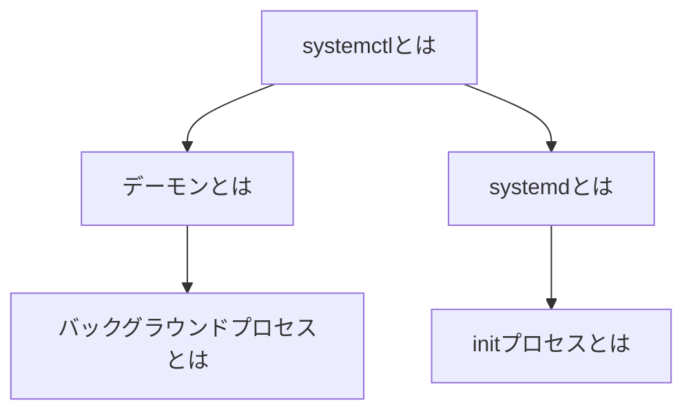

本記事では`systemctl`についてまとめています。

> 結論：「`systemctl`とは、デーモンの状態を確認・管理するコマンド」
>
> 厳密には、`systemctl`が`systemd`を通してデーモンを管理する。

## 経緯

先日、仮想マシンでUbuntuサーバを動かし、ホストOSからSSHで接続しました。  
そのために、UbuntuサーバにはSSHサーバのセットアップが必要です。

`systemctl`コマンドを使う中で色々と調べた結果、自分なりに`systemctl`周辺を理解できた手応えがあったので、まとめておきます。

## 知識マップ

私が思う`systemctl`の理解に必要な知識マップです。



## 本題

`systemctl`を理解するために、まずは**デーモン**と`systemd`を理解します。

### デーモンとは

デーモンとはUNIX系OSで動くバックグラウンドプロセスのことです。

> #### バックグラウンドプロセスとは：
> ユーザとは**切り離されて常駐するプログラム**のことです。  
> つまり、ユーザがログインしていなくても動くプログラムのことです。
> 
> 例えば、`Apache`などのWebサーバはバックグラウンドですが、  
開発中に使う`python -m http.server`などはユーザが直接起動して使うため、通常はフォアグラウンドとして扱います。

Webサーバやファイルサーバ、SSHサーバなどのプログラムはユーザのサーバへのログインの有無は関係なく、常駐してクライアントからのリクエストを処理しています。  
これらのプログラムを**デーモン**と呼びます。

### systemdとは

`systemd`とは`initプロセス（初期化プロセス）`のひとつであり、従来の`SysVinit`を置き換えるために登場しました。

> #### initプロセスとは：
> UNIX系OSで、**プログラムを動かす元のプログラムのこと**です。  
> 基本的にプログラムは「自分を動かしてくれるプログラム」がいないと動くことができません。
> 
> `initプロセス`は、他のプログラムを起動させる役割があり、すべてのプロセスの親になります。  
> 一般的には、コンピュータの起動直後に「`BIOS` → `ブートローダ` → `Linuxカーネル` →　`initプロセス`」と処理が進みます。  
> initプロセスの`PID（Process ID）`は1になっています。

つまり、`systemd`は他のプログラムを動かすことができる、すべてのプログラムの親のことです。

### systemctlとは

いよいよ本題です。

最初に書いたように、`systemctl`とは、デーモンの状態を確認・管理するコマンドです。  
厳密には、`systemd`を通してデーモンを管理します。

噛み砕くと「他のプログラムの親であるinitプロセス」に命令を出して「バックグラウンドプロセス」を管理するコマンドになります。

### systemctlの使い方

`systemctl`コマンドは次のように使います。

```sh
# 状態確認
systemctl status [プロセス名]

# 起動
systemctl start [プロセス名]

# 終了
systemctl stop [プロセス名]

# 自動起動の有効化
systemctl enable [プロセス名]

# 自動起動の無効化
systemctl disable [プロセス名]
```

## まとめ

本記事では、デーモンを管理する`systemctl`コマンドについて解説しました。  
重要なポイントを以下にまとめます。

- **デーモン**: ユーザーのログイン状態とは無関係に常駐するバックグラウンドプロセス（例: Webサーバ）。
- **systemd**: 他のプロセスを起動する役割を持つ、すべてのプロセスの親（`initプロセス`）。
- **systemctl**: `systemd`に対して命令を出し、デーモンの起動、停止、状態確認などを行う管理コマンド。

`systemctl`はLinuxシステム管理の基本ですが、その背景にある`systemd`やデーモンの仕組みを理解すると、より深くシステムを把握できます。

今回、`systemctl`を調べてみて、Linuxシステムの奥深さとその凄さを改めて感じました。  
複雑なシステムを理解するには、こうした知識の積み重ねが大事だと実感したので、これからも勉強を続けようと思います。
